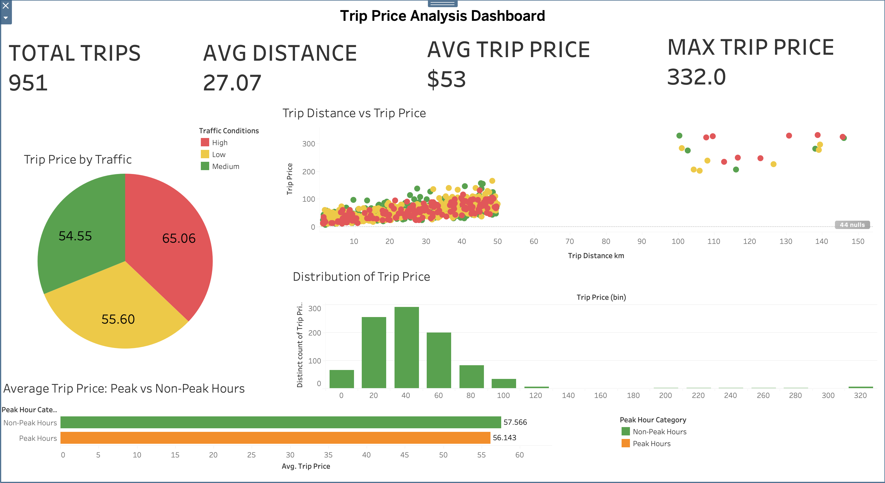

# Taxi Trip Price Prediction

Machine Learning project focused on analyzing and predicting taxi trip prices using trip-related features such as distance, duration, traffic conditions, weather, and time of day.

---

## Project Overview

This project includes:

- Data preprocessing
- Exploratory Data Analysis (EDA)
- Feature engineering
- Regression modeling
- Model evaluation
- Tableau dashboard visualization

The goal is to build a machine learning model capable of predicting taxi trip prices more accurately.

---

## Dataset Features

- Trip Distance
- Trip Duration
- Traffic Conditions
- Weather
- Time of Day
- Passenger Count
- Trip Price

---

## Technologies Used

- Python
- Pandas
- NumPy
- Matplotlib
- Scikit-learn
- Tableau Public
- Jupyter Notebook

---

## Machine Learning Models

- Linear Regression
- Polynomial Regression

Evaluation metrics:
- R² Score
- MSE
- RMSE

Polynomial Regression achieved the best performance with lower prediction error and higher accuracy.

---

## Tableau Dashboard

The project includes an interactive Tableau dashboard featuring:

- Total Trips
- Average Trip Price
- Average Distance
- Maximum Trip Price
- Traffic Condition Analysis
- Trip Price Distribution
- Distance vs Price Relationship

---

## Key Insights

- Trip distance has a strong positive relationship with trip price.
- High traffic conditions generally lead to higher average pricing.
- The dataset contains several high-price outliers.
- Most trips are concentrated within lower-to-mid price ranges.

---

## Project Structure

```bash
taxi-trip-price-prediction/
├── data/
├── images/
├── notebook/
│   └── taxi_price_prediction.ipynb
├── tableau/
├── README.md
├── requirements.txt
└── .gitignore


